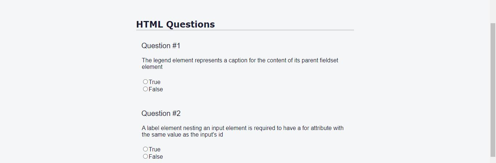
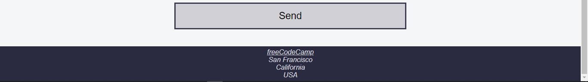

# Learn accessibility by building a quiz
 Created a mini step by step quiz from freecodecamp. the process was easy to learn and foloow.
 I edited the logo using the svg and giving it an aspect ratio to fit the nav. I also added a nav bar indicating the info, html, and css. 

# It was designed in:
1. HTML
2. CSS

# PREVIEW OF THE NAV BAR AND LOGO

# Design for the student info
the student info was implemented with a form and an input 

# preview of the student info

# Design for the html page
questions were added. I also added a margin and padding to it. I also removed the fieldset by making the border zero.

# Page review

# CSS VIEW
Implented the view of the pages

# CSS VIEW

# Footer 
added a view to the footer.

# footer view

